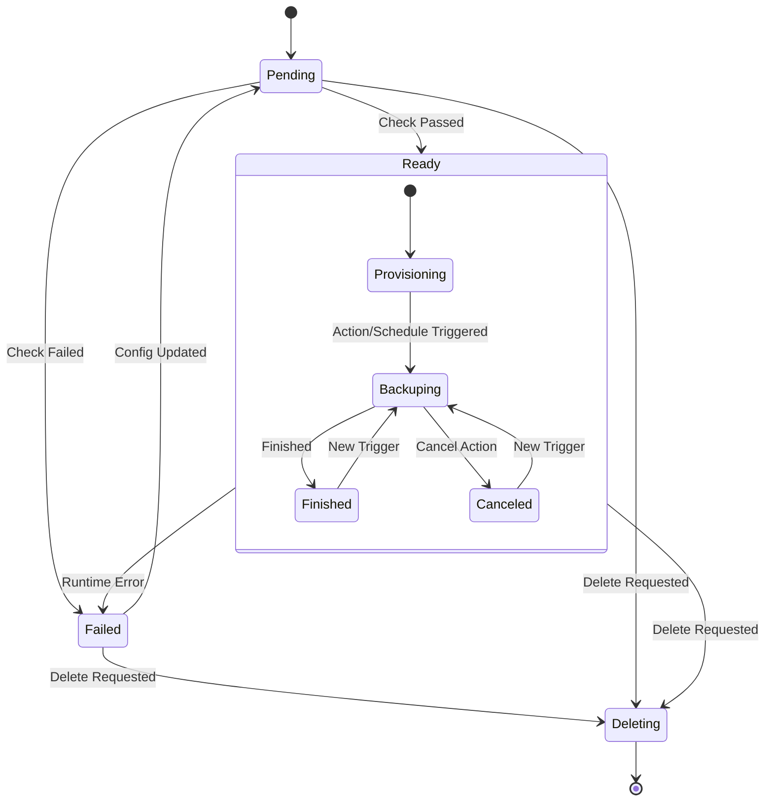

# Design: AppBackup State Machine

## Context
`AppBackup` 控制器当前在一个巨大的 `Reconcile` 函数中处理所有逻辑。为了提高可维护性，我们将采用**分层状态机**模式。
根据需求，`AppBackup` 拥有自己的生命周期状态（Phase），同时在 `Ready` 状态下管理备份任务的执行状态（BackupStatus）。

## Goals
- **双层状态**: 明确区分 **AppBackup 资源状态** (Lifecycle) 和 **备份任务状态** (Operation)。
- **依赖关系**: 只有当 AppBackup 处于 `Ready` 状态时，才能执行备份操作和状态流转。
- **解耦**: 将生命周期管理与备份执行逻辑分离。
- **幂等性**: 所有操作必须幂等。

## Architecture

### 1. Primary State Machine (AppBackup Lifecycle)
控制器根据 `AppBackup.Status.Phase` 驱动 AppBackup 自身的生命周期。

**Phases:**
1.  **PhasePending (初始化)**:
    -   **职责**: 验证配置，检查依赖（Cluster, StorageRepository），初始化 Finalizer。
    -   **流转**:
        -   检查通过 -> `PhaseReady`
        -   检查失败 -> `PhaseFailed`

2.  **PhaseReady (就绪/运行)**:
    -   **职责**: 资源处于健康状态，负责管理底层的 Velero 资源和备份任务。
    -   **逻辑 (Sub-logic)**:
        -   **Provisioning**: 确保 Velero Schedule 或一次性 Backup 存在。
        -   **Action Handling**: 响应 `Spec.Action` (Backup/Retry)，触发新备份。
        -   **Status Sync**: 同步 Velero 资源状态到 `AppBackup.Status.BackupStatus`。
    -   **流转**:
        -   依赖丢失/配置错误 -> `PhaseFailed`
        -   删除请求 -> `PhaseDeleting`

3.  **PhaseFailed (错误)**:
    -   **职责**: 停留在错误状态，等待人工干预或配置更新。
    -   **流转**:
        -   配置更新 -> `PhasePending` (重试)
        -   删除请求 -> `PhaseDeleting`

4.  **PhaseDeleting (删除)**:
    -   **职责**: 清理外部资源，移除 Finalizer。

### 2. Backup Operation Logic (Inside Ready Phase)
在 `PhaseReady` 状态下，控制器负责维护 `Status.LastBackupStatus` 和 `Status.History`。

**关键原则**:
1.  **Immediate Feedback (立即反馈)**: 当用户触发 Action (Backup/Retry) 时，控制器应立即将 `LastBackupStatus` 置为 `InProgress`，而不是等待 Velero Backup 创建并被 List 出来。
2.  **Persistent History (历史持久化)**: `Status.History` 不应仅仅是当前 Velero Backup 列表的映射（因为 Cancel 操作会删除 Backup）。它应该是一个**累积的日志**。
    -   当 Backup 被 Cancel（删除）时，History 中应保留一条状态为 `Canceled` 的记录。
    -   当 Backup 正常完成/失败时，更新 History 中对应的记录。

**Backup Status Lifecycle (LastBackupStatus):**

1.  **InProgress (进行中)**:
    -   **Entry**:
        -   **首次创建**: 当 AppBackup (非 Schedule) 首次创建时，控制器**立即**更新 `LastBackupStatus=InProgress`，然后创建 Velero Backup。
        -   **手动触发**: 用户设置 `Spec.Action=Backup/Retry`。控制器**立即**更新 `LastBackupStatus=InProgress`，然后创建 Velero Backup。
        -   **自动触发**: 观测到由 Schedule 创建的新 Velero Backup (Phase=New/InProgress)。
    -   **Logic**: 持续轮询 Velero Backup 状态，同步到 History。
    -   **Transition**:
        -   Velero Backup 完成 -> `Completed`
        -   Velero Backup 失败 -> `Failed`
        -   用户触发 Cancel -> `Canceled`

2.  **Completed (完成)**:
    -   **Entry**: 观测到最新 Backup Phase 为 `Completed`。
    -   **Logic**: 更新 History 记录。

3.  **Failed (失败)**:
    -   **Entry**: 观测到最新 Backup Phase 为 `Failed/PartiallyFailed`。
    -   **Logic**: 更新 History 记录。

4.  **Canceled (已取消)**:
    -   **Entry**: 用户触发 `Spec.Action=Cancel`。
    -   **Logic**:
        1.  找到正在运行的 Velero Backup。
        2.  **更新 History**: 在 `Status.History` 中将该 Backup 标记为 `Canceled`（防止删除后丢失记录）。
        3.  **更新状态**: 设置 `LastBackupStatus=Canceled`。
        4.  **执行删除**: 删除 Velero Backup 资源。
    -   **Result**: 即使底层 CR 被删除，用户仍能在 History 和 LastBackupStatus 中看到 "Canceled"。

**History Merge Strategy**:
每次 Reconcile 时，`Status.History` 的构建逻辑如下：
1.  **保留**: 保留现有的 History 记录（特别是那些已经不存在于集群中的 Canceled 记录）。
2.  **更新/追加**: 获取当前集群中的 Velero Backup 列表。
    -   如果 Backup 已在 History 中，更新其状态。
    -   如果 Backup 不在 History 中，追加到列表头部。
3.  **截断**: 按需保留最近 N 条记录（如 10 条）。

**关键机制**:
-   **Source of Truth**: `Status.History` 是 "AppBackup 自身记录" 与 "Velero 实际状态" 的聚合。
-   **Status Mapping**:
    -   Action 触发 -> 强制设为 `InProgress`。
    -   Cancel 触发 -> 强制设为 `Canceled`。
    -   其他情况 -> 跟随 Velero Backup Phase。

### 3. State Transition Diagram



### 4. Trigger Mechanisms (Event Handling)
为了及时观测到自动创建的备份或备份状态的变化，控制器需要监听以下事件：

1.  **AppBackup Changed**: 标准监听。
2.  **Velero Backup Changed**:
    -   **机制**: 使用 `builder.Watches` 监听 `velerov1.Backup` 资源。
    -   **Handler**: 实现 `EnqueueRequestsFromMapFunc`，从 Backup 的 Labels (`testudo.softcdata.com/app-backup-uid`) 中提取 AppBackup 的 Name/Namespace，触发 Reconcile。
    -   **目的**: 当 Velero Schedule 自动创建 Backup，或 Backup 状态（InProgress -> Completed）发生变化时，立即触发 AppBackup 的状态同步。
3.  **Polling (Fallback)**:
    -   如果 Watch 机制失效或有延迟，`ReadyHandler` 应返回 `RequeueAfter: 1m` 进行周期性兜底检查。

## Implementation Details

### State Handler Interface
```go
type StateHandler interface {
    Handle(ctx context.Context, r *AppBackupReconciler, appBackup *disasterv1.AppBackup) (nextPhase string, result ctrl.Result, err error)
}
```

### Handlers
1.  **PendingHandler**:
    -   检查 Cluster Client。
    -   检查 StorageRepository。
    -   **Step 1: Resource Check**: 检查 Velero Schedule/Backup 是否存在，不存在则创建（幂等）。如果创建失败 -> 返回 `PhaseFailed`。
    -   **Step 2: Action Check**: 检查 `Spec.Action`。
        -   **Backup/Retry**: 创建 Velero Backup（幂等）。
        -   **Cancel**: 如果当前有正在运行的 Backup，删除它。
    -   **Step 3: Sync**: List Velero Backups，更新 `Status.History` 和 `Status.BackupStatus`。 `PhaseFailed`。
    -   **Step 2: Action Check**: 检查 `Spec.Action`。如果需要备份，创建 Velero Backup（幂等）。
    -   **Step 3: Sync**: List Velero Backups，更新 `Status.History` 和 `Status.BackupStatus`。
3.  **FailedHandler**:
    -   记录 Event。
    -   检查 Spec 是否变更，若变更返回 `PhasePending`。
4.  **DeletingHandler**:
    -   执行 `deleteExternalResources`。
    -   Remove Finalizer。

## Risks
- **状态同步延迟**: Velero Backup 的状态变化可能需要几秒钟才能同步到 AppBackup。
- **并发**: 确保在 `ReadyHandler` 中处理 Action 时不会与 Schedule 的自动备份冲突（通过 UID/Name 区分）。
- **状态死锁**: 确保每个状态都有退出的路径（例如超时或错误重试）。
- **并发更新**: 状态更新需要使用乐观锁或重试机制。
- **兼容性**: 现有的 `Status.Status` 字段值可能需要映射到新的 Phase 常量，或者直接复用现有值但规范化其含义。

## Migration Plan
1.  定义 Phase 常量 (`PhaseNew`, `PhaseProvisioning`, `PhaseRunning` 等)。
2.  实现 `StateHandler` 接口和各个具体状态的 Handler。
3.  重写 `Reconcile` 方法，使用状态机驱动。
