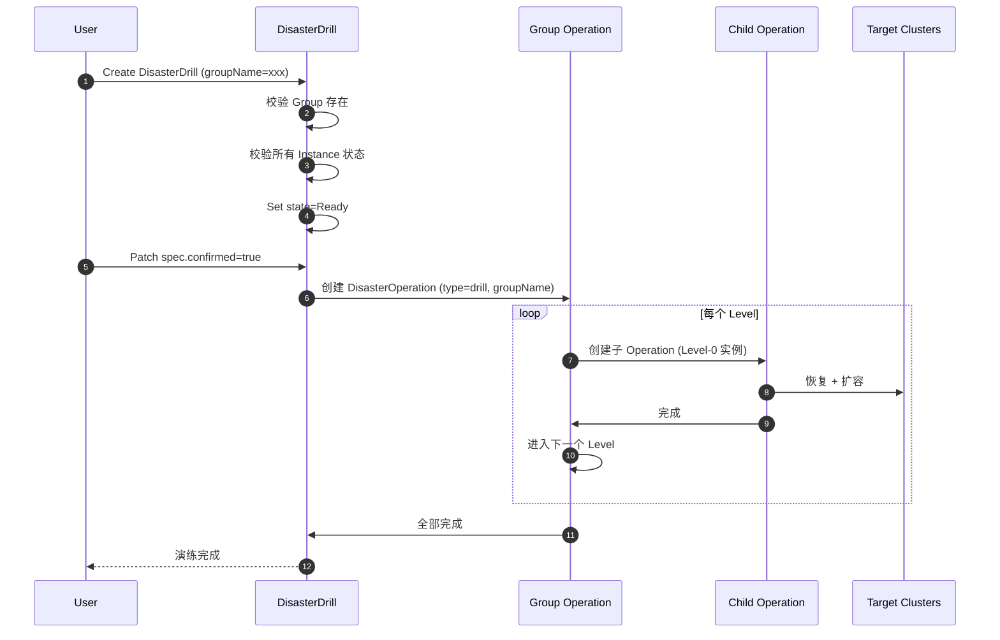
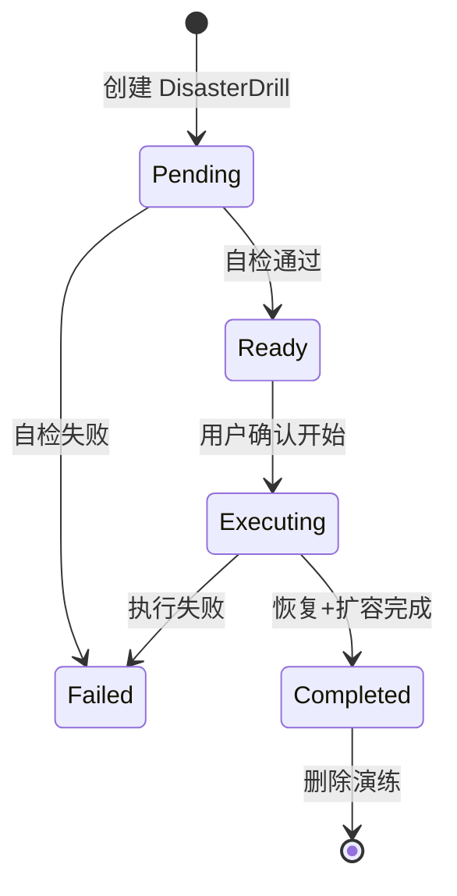
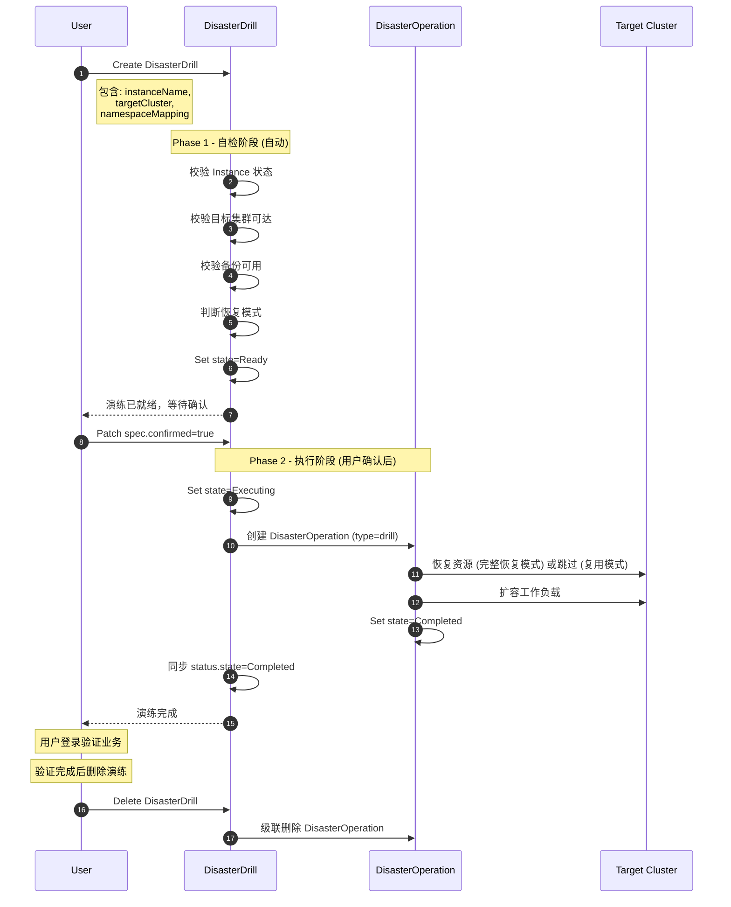

# Change: Drill (灾备演练) 编排流程设计

## Why (背景)

生产环境中，用户需要定期验证：
1. **数据完整性**: 备份的数据是否真的能恢复？
2. **业务可用性**: 恢复后的应用是否能正常启动？
3. **流程有效性**: RTO 是否满足预期？

**与 YS1000 对齐**：容灾演练模拟的是主集群故障场景，它直接使用**最后一次备份（或同步）的资源和数据**进行恢复，验证恢复动作的可执行性。

## What Changes (核心设计)

### 1. 演练 vs 切换的核心区别

| 维度 | 容灾演练 (Drill) | 容灾切换 (Failover) |
|------|-----------------|-------------------|
| **数据来源** | 最近一次备份 | 执行 Final Sync 后的数据 |
| **恢复方式** | ✅ **始终执行 AppRestore** | ✅ 扩容已同步资源 |
| **源端操作** | ❌ 不缩容源端 | ✅ 缩容源端 (避免脑裂) |
| **目标端操作** | ✅ 恢复 + 扩容 | ✅ 扩容目标端 |
| **成功标准** | 资源级 (恢复完成) | 业务级 (Pod Ready) |
| **角色切换** | ❌ 不交换主备 | ✅ 交换主备角色 |
| **同步调度** | ❌ 不暂停 | ✅ 暂停调度 |
| **生命周期** | **一次性** (用完即删) | 持久状态变更 |

> **设计原则**: 容灾演练模拟主集群故障场景，**始终使用最后一次备份执行完整恢复**，验证恢复动作的可执行性。不使用复用模式，确保验证的是真正的恢复能力。

### 2. 演练生命周期

演练是一次性操作，包含两个阶段：

```
创建演练 ──> 校验就绪 ──> 用户确认开始 ──> 执行恢复+扩容 ──> 删除演练
   │            │                              │
   │   (仅校验基础信息)                   (用户验证业务)
   │                                           │
   └───────────────────────────────────────────┘
                  下次演练：重新创建
```

### 3. 资源模型

引入新的 **DisasterDrill** CRD，支持两种模式：
- **实例演练**: 针对单个 DisasterInstance
- **容灾组演练**: 针对 DisasterGroup，按 Level 顺序执行

```
┌──────────────────────────────────────────────────────────────────────┐
│ 用户创建 DisasterDrill                                                │
│ (包含: 实例引用 OR 容灾组引用, 目标集群, 命名空间映射等)               │
└───────────────────────────────┬──────────────────────────────────────┘
                                │
                                ▼
┌──────────────────────────────────────────────────────────────────────┐
│ DisasterDrill Controller                                              │
│ - 判断是 Instance 演练还是 Group 演练                                 │
│ - Instance: 创建单个 DisasterOperation (type=drill)                  │
│ - Group: 创建 DisasterOperation (type=drill, groupName=xxx)          │
│ - 同步 Status                                                        │
└──────────────────────────────────────────────────────────────────────┘
```

### 3.1 容灾组演练特点

| 维度 | 实例演练 | 容灾组演练 |
|------|----------|-----------|
| **触发方式** | 指定 `instanceName` | 指定 `groupName` |
| **执行顺序** | 单次执行 | 按 Group.Levels 顺序执行 |
| **子操作** | 1 个 DisasterOperation | 多个子 DisasterOperation |
| **失败策略** | 直接失败 | 自动继承 Group.Policy.FailPolicy (`Stop`/`Continue`) |
| **状态汇总** | 单实例状态 | 聚合所有实例状态 |

### 3.3 安全性校验

为了防止演练误操作影响生产容灾环境，必须执行以下冲突校验：

1. **同环境冲突**: 如果演练 `TargetCluster` 等于关联 Instance 的 `SecondaryCluster`，**且** `NamespaceMapping` 为空（或映射结果与 Instance 所在 Namespace 相同）：
   - **禁止执行**，Validating 阶段直接报错或置为 Failed。
   - 报错信息: "危险操作：演练将覆盖生产备用环境，请配置 NamespaceMapping 或使用其他 TargetCluster"。


### 3.2 容灾组演练流程



```
┌─────────────────────────────────────────────────────────────────────┐
│ 用户创建 DisasterDrill                                               │
│ (包含: 实例引用, 目标集群, 命名空间映射等)                            │
└───────────────────────────────┬─────────────────────────────────────┘
                                │
                                ▼
┌─────────────────────────────────────────────────────────────────────┐
│ DisasterDrill Controller                                             │
│ - 创建 DisasterOperation (type=drill)                               │
│ - 同步 Status                                                       │
└─────────────────────────────────────────────────────────────────────┘
```

### 4. 演练执行流程





### 4. 演练状态定义

```go
type DrillState string

const (
    DrillStatePending   DrillState = "Pending"    // 创建中
    DrillStateReady     DrillState = "Ready"      // 校验通过，等待用户确认
    DrillStateExecuting DrillState = "Executing"  // 执行中 (恢复 + 扩容)
    DrillStateCompleted DrillState = "Completed"  // 完成
    DrillStateFailed    DrillState = "Failed"     // 失败
)
```

### 6. 详细阶段说明

#### Phase 1: 自检阶段 (DisasterDrill Controller 自动执行)

创建 DisasterDrill 后，Controller 自动执行自检，**不创建 DisasterOperation**：

- **校验 Instance**: 检查 Instance 状态是否为 `Protected` 或 `Active`
- **校验目标集群**: 检查 targetCluster 是否已注册且可达
- **校验备份**: 检查 DataSync 和 ResourceSync 是否有可用的最近备份
- **可选**: 如果用户设置 `skipValidation: true`，跳过部分校验
- **状态变更**: 自检通过后状态变为 `Ready`

#### Phase 2: 执行阶段 (用户确认后执行)

**触发条件**: 用户 Patch `spec.confirmed = true`

**Step 2.0: 创建 DisasterOperation**
- DisasterDrill Controller 创建 DisasterOperation (type=drill)
- 设置 ownerReferences 指向 DisasterDrill
- DisasterDrill 状态变为 `Executing`

**Step 2.1: RestoreResource (恢复资源)**

从 `ResourceSync.Status.LastBackupName` 恢复 K8s 资源：
- 创建 **资源恢复 AppRestore**
- 恢复资源 (Deployment/StatefulSet/Service 等)
- 应用 ResourceModifier：将 replicas 设置为 0
- 如果指定了 namespaceMapping，应用命名空间映射
- 等待 AppRestore 完成后进入下一步

> **注意**: 资源恢复会覆盖目标集群上已存在的同名资源。

**Step 2.2: RestoreData (恢复数据)**

从 `DataSync.Status.LastBackupName` 恢复 PVC 数据：
- 创建 **数据恢复 AppRestore**
- 恢复数据 (PVC + 数据)
- 如果指定了 namespaceMapping，应用命名空间映射
- 等待 AppRestore 完成后进入下一步

**Step 2.3: ScaleUpTarget (扩容)**
- **读取副本数**: 从备份中提取原始副本数
- **扩容**: Patch 目标集群的 Deployment/StatefulSet replicas
- **成功标准**: 资源级成功 - 扩容动作执行完成即为成功
- **不检查 Pod 状态**: 与 YS1000 行为一致，不强制检查 Pod Running

### 7. CRD 设计

#### DisasterDrill (用户直接操作的资源)

```yaml
apiVersion: testudo.softcdata.com/v1
kind: DisasterDrill
metadata:
  name: drill-20260206-001
spec:
  # 二选一：关联的容灾实例 OR 容灾组
  instanceName: my-app-dr           # 实例演练
  # groupName: my-app-group         # 容灾组演练 (与 instanceName 互斥)
  
  # 可选：指定演练目标集群（不指定则使用 Instance 的 secondaryCluster）
  targetCluster: "cluster-test-lab"
  # 可选：命名空间映射（不指定则使用原始命名空间）
  namespaceMapping:
    app-ns: drill-app-ns      # app-ns 恢复到 drill-app-ns
    db-ns: drill-db-ns        # db-ns 恢复到 drill-db-ns
  # 可选：跳过前置校验
  skipValidation: false
  # 用户确认开始执行 (Ready -> Executing)
  confirmed: false
  
  # 注意：失败策略将自动继承自 DisasterGroup.spec.policy.failPolicy
```

#### 容灾组演练示例

```yaml
apiVersion: testudo.softcdata.com/v1
kind: DisasterDrill
metadata:
  name: group-drill-20260206
spec:
  # 指定容灾组名称
  groupName: my-app-group
  # 可选：统一的目标集群（不指定则使用各 Instance 的 secondaryCluster）
  targetCluster: "cluster-test-lab"
  # 可选：统一的命名空间映射前缀
  namespaceMapping:
    app-ns: drill-app-ns
  confirmed: false
```

#### DisasterDrill Status

```yaml
status:
  state: Ready  # Pending / Ready / Executing / Completed / Failed
  operationName: drill-op-20260206-001  # 关联的 DisasterOperation 名称
  startTime: "2026-02-06T10:00:00Z"
  readyTime: "2026-02-06T10:00:05Z"
  executionTime: "2026-02-06T10:05:00Z"
  completionTime: "2026-02-06T10:08:00Z"
  targetCluster: "cluster-test-lab"
  # 失败策略来源于 DisasterGroup.Spec.Policy.FailPolicy
  restoreMode: "FullRestore"
  message: "演练已就绪，请设置 spec.confirmed=true 开始执行。"
  
  # 容灾组演练特有字段
  groupProgress:
    totalLevels: 3
    completedLevels: 2
    currentLevel: 2
    instanceResults:
      - instanceName: frontend-dr
        state: Completed
      - instanceName: backend-dr
        state: Completed
      - instanceName: database-dr
        state: Executing
```

#### DisasterOperation (由 Controller 自动创建)

```yaml
apiVersion: testudo.softcdata.com/v1
kind: DisasterOperation
metadata:
  name: drill-op-20260206-001
  ownerReferences:
    - apiVersion: testudo.softcdata.com/v1
      kind: DisasterDrill
      name: drill-20260206-001
spec:
  instanceName: my-app-dr
  operationType: drill
  drillConfig:
    targetCluster: "cluster-test-lab"
    namespaceMapping:
      app-ns: drill-app-ns
      db-ns: drill-db-ns
    namespaceMapping:
      app-ns: drill-app-ns
      db-ns: drill-db-ns
    namespaceMapping:
      app-ns: drill-app-ns
      db-ns: drill-db-ns
    skipValidation: false
  directive:
    confirmed: false
```

**说明**：
- **DisasterDrill**: 用户直接创建和操作的资源，包含演练配置。
- **DisasterOperation**: 由 DisasterDrill Controller 自动创建，通过 `ownerReferences` 关联。
- 用户通过 Patch `DisasterDrill.spec.confirmed=true` 来确认开始执行。
- 删除 DisasterDrill 会级联删除关联的 DisasterOperation。

### 7. 恢复行为说明

演练**始终使用完整恢复模式**，不使用复用模式。

**设计理由**:
- 容灾演练的核心目的是验证**从备份恢复**的能力
- 复用模式仅验证扩容机制，无法验证恢复流程本身
- 统一行为简化实现和用户理解

```
┌─────────────────────────────────────────────────────────────────────┐
│                        演练恢复行为                                  │
├─────────────────────────────────────────────────────────────────────┤
│                                                                     │
│  ✅ 始终执行 AppRestore (完整恢复模式)                               │
│                                                                     │
│  恢复目标:                                                          │
│    - targetCluster: 指定则使用，否则默认 secondaryCluster           │
│    - namespaceMapping: 指定则映射，否则使用原始命名空间              │
│                                                                     │
│  恢复内容:                                                          │
│    - 从最后一次备份恢复资源和数据                                    │
│    - 应用 ResourceModifier (replicas=0)                            │
│    - 应用命名空间映射 (如指定)                                       │
│                                                                     │
└─────────────────────────────────────────────────────────────────────┘
```

**示例**：

| 配置 | 行为 | 说明 |
|------|------|------|
| `targetCluster: null, namespaceMapping: null` | 恢复到备集群原命名空间 | 覆盖已有 Skeleton 资源 |
| `targetCluster: "第三方集群"` | 恢复到第三方集群 | 完全独立的演练环境 |
| `namespaceMapping: {app-ns: drill-ns}` | 恢复到新命名空间 | 不影响原有资源 |

#### DisasterOperation Status

```yaml
status:
  state: Ready  # Pending / Ready / Executing / Completed / Failed
  startTime: "2026-02-06T10:00:00Z"
  readyTime: "2026-02-06T10:00:05Z"       # 校验完成时间
  executionTime: "2026-02-06T10:05:00Z"   # 用户确认执行时间
  completionTime: "2026-02-06T10:08:00Z"
  targetCluster: "cluster-test-lab"        # 实际使用的目标集群
  namespaceMapping:                        # 实际使用的命名空间映射
    app-ns: drill-app-ns
  restoreMode: "FullRestore"               # Reuse / FullRestore
  dataRestoreName: "drill-data-restore-20260206"       # 数据恢复 AppRestore 名称
  resourceRestoreName: "drill-resource-restore-20260206" # 资源恢复 AppRestore 名称
  replicasRecord:                          # 原始副本数记录
    - namespace: drill-app-ns              # 映射后的命名空间
      kind: Deployment
      name: frontend
      replicas: 3
  message: "演练已就绪，请确认后开始执行。"
```

### 9. 用户操作流程

```bash
# 1. 创建演练
cat <<EOF | kubectl apply -f -
apiVersion: testudo.softcdata.com/v1
kind: DisasterDrill
metadata:
  name: drill-20260206-001
spec:
  instanceName: my-app-dr
  targetCluster: "cluster-test-lab"
  namespaceMapping:
    app-ns: drill-app-ns
  confirmed: false
EOF

# 2. 等待校验完成 (通常几秒钟)
kubectl wait --for=jsonpath='{.status.state}'=Ready disasterdrill/drill-20260206-001

# 3. 确认开始执行
kubectl patch disasterdrill drill-20260206-001 --type=merge \
  -p '{"spec":{"confirmed":true}}'

# 4. 等待完成 (恢复 + 扩容)
kubectl wait --for=jsonpath='{.status.state}'=Completed disasterdrill/drill-20260206-001

# 5. 用户验证业务...

# 6. 删除演练 (清理，会级联删除 DisasterOperation)
kubectl delete disasterdrill drill-20260206-001
```

### 10. 与 Failover 的代码复用

| 组件 | Drill 使用方式 |
|------|---------------|
| `Restore` 步骤 | ✅ 完全复用 AppRestore 创建逻辑 |
| `ScaleUpTarget` 步骤 | ✅ 完全复用 |
| Instance 状态检查 | ✅ 复用，但可跳过 |
| `ScaleDownSource` | ❌ **不执行** |
| `FinalSync` | ❌ **不执行** |
| `SwitchRoles` | ❌ **不执行** |

### 11. 演练后的状态

演练完成后，系统状态：
- **源集群**: 无变化，继续提供服务
- **目标集群**: 工作负载已恢复并扩容，用户可验证业务
- **DisasterInstance**: 状态保持 `Protected` 不变
- **同步调度**: 继续正常运行

### 12. 演练清理

用户验证完成后，删除 DisasterDrill CR：
- 级联删除关联的 DisasterOperation
- 下一次 ResourceSync 会自动将目标集群恢复到 Standby 状态 (replicas=0)
- 或者用户手动缩容目标集群

**注意**：演练是**一次性**的，下次演练需要重新创建 DisasterDrill。

## Impact (影响)

### disaster-operator
- **DisasterDrill Controller** (新增):
  - 监听 DisasterDrill 资源
  - 支持 `instanceName` 和 `groupName` 两种模式
  - 实例演练: 创建单个 DisasterOperation (type=drill)
  - 容灾组演练: 创建 DisasterOperation (type=drill, groupName=xxx)
  - 同步 `spec.confirmed` 到 DisasterOperation
  - 同步 DisasterOperation Status 到 DisasterDrill Status
  - 同步 DisasterOperation Status 到 DisasterDrill Status
  - 容灾组演练: 聚合子操作状态到 `status.groupProgress`
  - **安全校验**: 在 Validating 阶段检查 TargetCluster/Namespace 是否与 Instance 冲突
- **DisasterOperation Controller**: 
  - 新增 `handleDrill` 逻辑
  - 校验阶段：仅检查基础信息
  - 执行阶段：恢复 + 扩容
  - 容灾组演练 (`handleGroupOperation`): 
    - **透传配置**: 必须将父 Operation 的 `DrillConfig` (包含 TargetCluster, NamespaceMapping) DeepCopy 到子 Operation
    - **失败策略**: 根据 `DisasterGroup.Spec.Policy` 决定是否继续执行下一 Level

### disaster-server
- **API**: 
  - 新增 DisasterDrill CRUD 接口
  - 新增 `confirmDrill` 接口 (Patch confirmed=true)
  - 支持 `instanceName` 和 `groupName` 两种创建模式
- **返回值**: 
  - 返回演练状态 (Ready/Executing/Completed)
  - 容灾组演练: 返回 `groupProgress` 进度信息

## 非目标 (Non-Goals)

本提案**不包含**以下功能：
1. ❌ 沙箱隔离：不创建临时命名空间（除非用户指定 targetNamespace）
2. ❌ 网络隔离：不修改 Service/Ingress
3. ❌ 自动清理：不自动清理演练环境
4. ❌ 实时同步：演练前不自动触发同步
5. ❌ 演练复用：每次演练需要重新创建
6. ❌ 预恢复：校验阶段不执行任何恢复操作

这些设计与 YS1000 的演练行为保持一致。

## 相关规范

- [AppRestore 构建器规范](../../specs/restore-builder/spec.md) - 定义了资源恢复和数据恢复的统一构建接口
