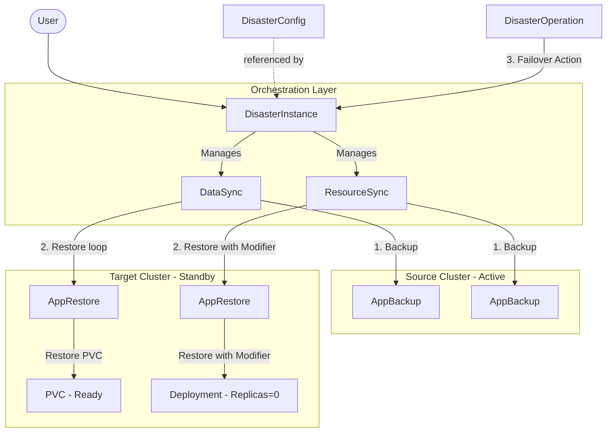
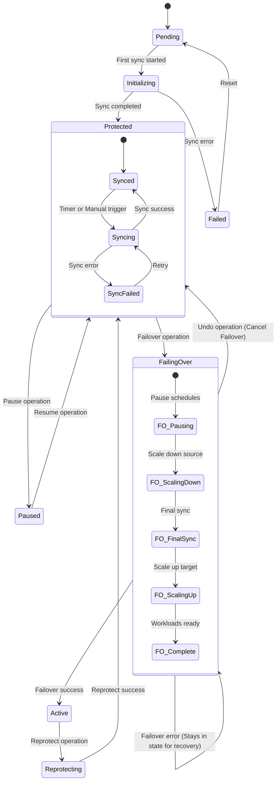
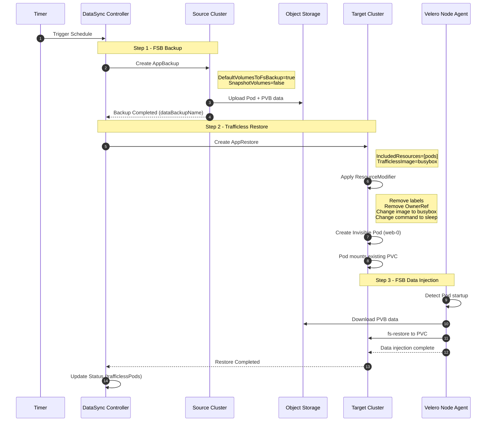
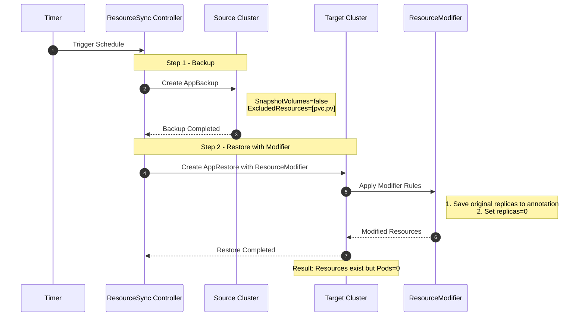
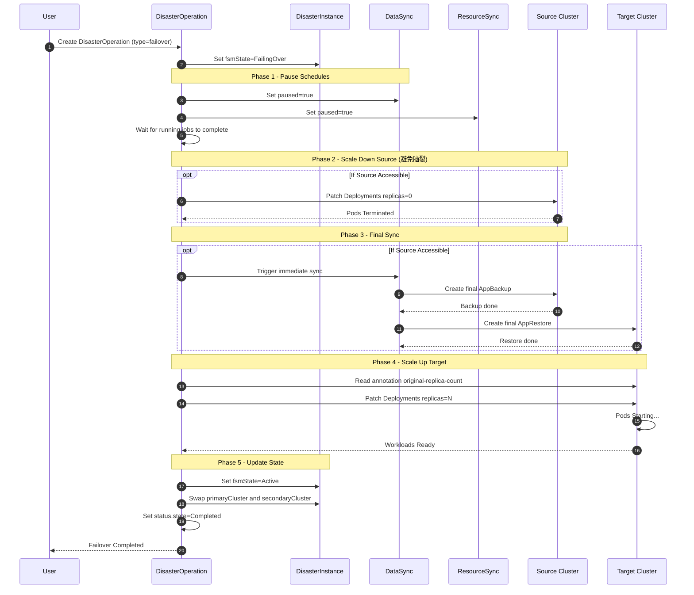
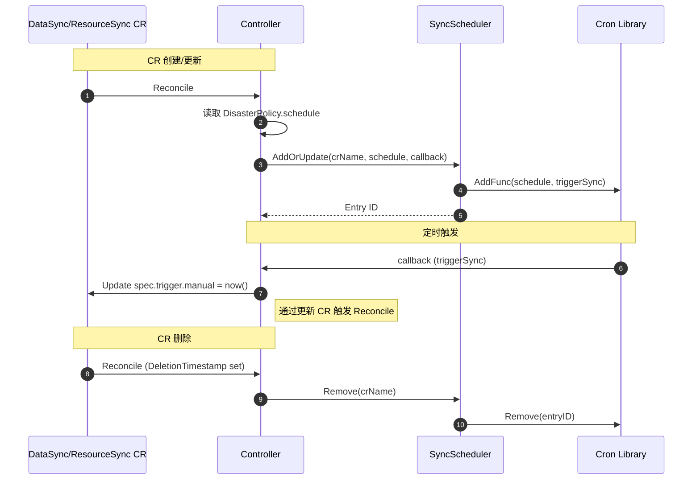

# Design: V2.0 容灾编排系统技术设计

## 1. 核心架构

### 1.1 系统架构图

V2 采用 **Pilot Light (长明火)** 架构：数据和资源持续同步到备集群，但备集群应用处于"关停"状态（Replicas=0），直到故障切换时才拉起。



### 1.2 CRD 层级关系

```
DisasterConfig (配置模板)
       ↑ referenced by
DisasterInstance (顶层编排)
       ↓ owns
       ├── DataSync (数据同步)
       │      ↓ creates
       │      └── AppBackup/AppRestore
       │
       └── ResourceSync (资源同步)
              ↓ creates
              └── AppBackup/AppRestore (with ResourceModifier)

DisasterOperation (操作执行)
       ↓ operates on
       └── DisasterInstance
```

---

## 2. 状态机设计

### 2.1 DisasterInstance 状态机



### 2.2 状态转换规则

| 当前状态 | 事件 | 目标状态 | 条件 |
|---------|------|---------|------|
| `Pending` | Reconcile | `Initializing` | DataSync 和 ResourceSync 已创建 |
| `Initializing` | SyncComplete | `Protected` | 首次同步成功 |
| `Protected` | PauseOp | `Paused` | 用户发起暂停操作 |
| `Paused` | ResumeOp | `Protected` | 用户发起恢复操作 |
| `Protected` | FailoverOp | `FailingOver` | 用户发起切换操作 |
| `FailingOver` | AllStepsComplete | `Active` | 所有切换步骤完成 |
| `Active` | ReprotectOp | `FailingBack` | 用户发起反向保护操作 |
| `FailingBack` | AllStepsComplete | `Protected` | 反向保护完成（主备维持B为主，反向同步） |
| `Active` | UndoOp | `Protected` | 用户发起撤销切换（缩容B，扩容A，切回A为主） |

---

## 3. 同步机制设计

### 3.1 DataSync 数据同步 (Trafficless Restore 方案)

采用 **V2 Scheme A: Trafficless Restore** 方案，利用"隐形 Pod"完成 FSB 数据注入。

#### 核心原理

```
┌───────────────────────────────────────────────────────────────────────────┐
│                    Trafficless Restore 数据注入流程                        │
├───────────────────────────────────────────────────────────────────────────┤
│                                                                            │
│  前提条件 (由 ResourceSync 完成):                                           │
│  ┌────────────────────────────────────────────────────────────────────┐   │
│  │ Target Cluster:                                                     │   │
│  │   - StatefulSet web (replicas=0)  ✓ 存在                            │   │
│  │   - PVC www-web-0                 ✓ 存在 (Bound, Empty)             │   │
│  │   - Service web                   ✓ 存在                            │   │
│  │   - Pod web-0                     ✗ 不存在                          │   │
│  └────────────────────────────────────────────────────────────────────┘   │
│                                                                            │
│  DataSync 执行:                                                            │
│  ┌────────────────────────────────────────────────────────────────────┐   │
│  │ 1. 创建 AppRestore (IncludedResources: pods)                        │   │
│  │                                                                     │   │
│  │ 2. 应用 ResourceModifier:                                           │   │
│  │    - Remove Labels (app: nginx)  → 确保无流量                        │   │
│  │    - Remove OwnerReference       → 确保不被 STS 删除                 │   │
│  │    - Change Image (busybox)      → 确保无业务逻辑                    │   │
│  │    - Change Command (sleep 3600) → 保持 Pod 运行                     │   │
│  │                                                                     │   │
│  │ 3. 隐形 Pod web-0 创建:                                              │   │
│  │    - 名字是 web-0 → 自动挂载 www-web-0 PVC                           │   │
│  │    - 名字是 web-0 → Velero 能找到对应的 PVB 数据                      │   │
│  │    - 没有标签 → Service 无法路由流量                                  │   │
│  │    - 没有 OwnerRef → STS Controller 忽略它                           │   │
│  │                                                                     │   │
│  │ 4. Velero Node Agent 检测到 Pod 启动                                 │   │
│  │    - 执行 fs-restore                                                │   │
│  │    - 将备份数据写入 PVC                                              │   │
│  └────────────────────────────────────────────────────────────────────┘   │
│                                                                            │
│  结果:                                                                     │
│  ┌────────────────────────────────────────────────────────────────────┐   │
│  │ Target Cluster:                                                     │   │
│  │   - StatefulSet web (replicas=0)  ✓                                 │   │
│  │   - PVC www-web-0                 ✓ 已填充数据                       │   │
│  │   - Pod web-0 (隐形, busybox)     ✓ 运行中, 无流量                   │   │
│  └────────────────────────────────────────────────────────────────────┘   │
└───────────────────────────────────────────────────────────────────────────┘
```

#### 时序图



#### DataSync Spec 定义

```go
type DataSyncSpec struct {
    // 关联的 DisasterInstance
    Instance string `json:"instance"`
    
    // 触发配置
    Trigger TriggerSpec `json:"trigger"`
    
    // 是否暂停
    Paused bool `json:"paused,omitempty"`
    
    // Trafficless 配置
    TrafficlessConfig *TrafficlessConfig `json:"trafficlessConfig,omitempty"`
}

type TrafficlessConfig struct {
    // 隐形 Pod 使用的镜像 (默认 busybox:latest)
    Image string `json:"image,omitempty"`
    
    // 隐形 Pod 执行的命令 (默认 ["sleep", "3600"])
    Command []string `json:"command,omitempty"`
    
    // 要移除的标签 (用于断开 Service 流量)
    RemoveLabels []string `json:"removeLabels,omitempty"`
}
```

#### DataSync Status 定义

```go
type DataSyncStatus struct {
    // 状态
    State string `json:"state"` // Ready / InProgress / Failed
    
    // 最后同步时间
    LastSyncTime *metav1.Time `json:"lastSyncTime,omitempty"`
    
    // 最近的备份名称
    LastBackupName string `json:"lastBackupName,omitempty"`
    
    // 最近的恢复名称
    LastRestoreName string `json:"lastRestoreName,omitempty"`
    
    // 当前存在的隐形 Pod 列表
    TrafficlessPods []TrafficlessPodStatus `json:"trafficlessPods,omitempty"`
    
    // 条件
    Conditions []metav1.Condition `json:"conditions,omitempty"`
}

type TrafficlessPodStatus struct {
    Name      string `json:"name"`
    Namespace string `json:"namespace"`
    PVCName   string `json:"pvcName"`
    Phase     string `json:"phase"` // Running / Completed
}
```

#### ResourceModifier 配置

DataSync Controller 在创建 AppRestore 时，自动生成以下 ResourceModifier:

```yaml
apiVersion: velero.io/v1
kind: ConfigMap
metadata:
  name: datasync-trafficless-modifier
  namespace: velero
  labels:
    velero.io/plugin-config: ""
    velero.io/resource-modifier: "true"
data:
  modifierConfig: |
    version: v1
    resourceModifierRules:
    # 移除 Service Selector 标签
    - conditions:
        groupResource: pods
      patches:
      - operation: remove
        path: "/metadata/labels/app"
      - operation: remove
        path: "/metadata/labels/app.kubernetes.io~1name"
    
    # 移除 OwnerReference
    - conditions:
        groupResource: pods
      patches:
      - operation: remove
        path: "/metadata/ownerReferences"
    
    # 替换镜像和命令
    - conditions:
        groupResource: pods
      patches:
      - operation: replace
        path: "/spec/containers/0/image"
        value: "busybox:latest"
      - operation: replace
        path: "/spec/containers/0/command"
        value: ["sleep", "3600"]
```

### 3.2 ResourceSync 资源同步

#### Standby 模式实现



#### ResourceModifier 配置

```yaml
# AppRestore 中配置的 ResourceModifier
resourceModifierRef:
  name: standby-modifier

---
apiVersion: velero.io/v1
kind: ResourceModifier
metadata:
  name: standby-modifier
spec:
  rules:
  # 规则1: 保存原始副本数到注解
  - conditions:
      groupResource: apps/deployments
    patches:
    - operation: add
      path: "/metadata/annotations/testudo.softcdata.com~1original-replica-count"
      value: "${.spec.replicas}"
      
  # 规则2: 设置副本数为0
  - conditions:
      groupResource: apps/deployments
    patches:
    - operation: replace
      path: "/spec/replicas"
      value: 0
```

---

## 4. 运维操作流程设计 (Failover, Reprotect, Undo)

### 4.1 Failover 时序图



### 4.2 Failover 步骤定义

```go
type FailoverStep string

const (
    FailoverStepPauseSchedules  FailoverStep = "PauseSchedules"
    FailoverStepScaleDownSource FailoverStep = "ScaleDownSource"
    FailoverStepFinalSync       FailoverStep = "FinalSync"
    FailoverStepScaleUpTarget   FailoverStep = "ScaleUpTarget"
    FailoverStepSwitchRoles     FailoverStep = "SwitchRoles"
)

type StepStatus struct {
    Name           FailoverStep `json:"name"`
    State          string       `json:"state"` // Pending/Running/Completed/Failed/Skipped
    StartTime      *metav1.Time `json:"startTime,omitempty"`
    CompletionTime *metav1.Time `json:"completionTime,omitempty"`
    Message        string       `json:"message,omitempty"`
}
```

### 4.3 强制切换 (Forced Failover)

当源集群不可达时，用户可以选择强制切换：

```yaml
apiVersion: testudo.softcdata.com/v1
kind: DisasterOperation
metadata:
  name: forced-failover-20260106
spec:
  instanceName: my-app-dr
  operationType: failover
  directives:
  - phase: execute
    force: true              # 强制切换，跳过源集群操作
    skipFinalSync: true      # 跳过最后一次同步
```

强制模式下：
- 跳过 `ScaleDownSource` 步骤
- 跳过 `FinalSync` 步骤
- 直接执行 `ScaleUpTarget`

---

### 4.4 Reprotect (反向保护) 流程

**定位**: 确认故障切换，建立反向同步 (Direction Sync)。

*   **场景**: 主集群 (Source) 故障后，备集群 (Target) 已接管业务 (Active)。管理员决定长期使用新主集群，需为原故障集群建立数据保护。
*   **动作**:
    1.  **Pause Schedules**: 暂停调度（重置状态）。
    2.  **Resume Schedules**: 恢复调度。此时由于主备角色已在 Failover 阶段互换 (Pri=B, Sec=A)，DataSync 控制器会自动识别并建立 B -> A 的同步链路。
    3.  **Trigger Immediate Sync**: 手动触发一次 DataSync 和 ResourceSync，确保反向保护立即生效。
*   **结果**:
    *   主集群: **Target (B)** (保持 Active)。
    *   备集群: **Source (A)** (保持 Standby/0副本)。
    *   同步方向: **B -> A**。
    *   状态: **Protected**。

### 4.5 Undo (撤销切换) 流程

**定位**: 放弃故障切换，回滚到原主集群。

*   **场景**: 误操作触发 Failover，或者 Failover 仅用于临时维护/演练，现需切回原主集群。
*   **动作**:
    1.  **ScaleDown Target**: 缩容当前主集群 (B)。
    2.  **ScaleUp Source**: 扩容原主集群 (A)。
    3.  **Switch Roles**: 交换主备角色记录 (Pri=A, Sec=B)。
    4.  **Resume Schedules**: 恢复调度。DataSync 识别 Pri=A，建立 A -> B 的同步链路。
*   **结果**:
    *   主集群: **Source (A)** (恢复 Active)。
    *   备集群: **Target (B)** (恢复 Standby)。
    *   同步方向: **A -> B**。
    *   状态: **Protected**。

### 4.6 与 Failback 的关系

本系统不再使用模糊的 "Failback" 术语，而是将其拆解为两个精确的操作路径：

1.  **Reprotect (反向保护)**: 对应 "永久切换 (Permanent Failover)" 后的保护重建。它承认切换事实，固化 B 为新主。
2.  **Undo (撤销切换)**: 对应 "临时切换 (Temporary Failover)" 后的回滚。它否定切换事实，恢复 A 为旧主。

用户根据业务意图选择：如果打算长期在 B 运行，请执行 **Reprotect**；如果只是临时验证或误切，请执行 **Undo**。

### 4.7 副本数记录机制 (Replica Recording)

#### 问题背景

在 Failover 流程中，`ScaleUpTarget` 步骤需要知道目标集群工作负载的原始副本数，以便正确恢复。但存在以下挑战：

1. **ResourceModifier 限制**: Velero 的 ResourceModifier 不支持动态模板（如 `${.spec.replicas}`），无法可靠地将原始副本数保存到 Annotations。
2. **时序问题**: 如果在 `ScaleDownSource` 之后才记录副本数，扫描到的将是 0。

#### 解决方案: ConfigMap 双重保护

采用 **Record-Before-ScaleDown + Preserve-Non-Zero** 策略：

```
┌─────────────────────────────────────────────────────────────────────────────┐
│                        Failover 副本数记录流程                               │
├─────────────────────────────────────────────────────────────────────────────┤
│                                                                             │
│  正常同步阶段 (ResourceSync):                                                │
│  ┌─────────────────────────────────────────────────────────────────────┐   │
│  │ 1. recordReplicasToConfigMap 扫描源集群                              │   │
│  │ 2. 记录 {namespace/kind/name: replicas} 到 ConfigMap                │   │
│  │ 3. ConfigMap 名称: replicas-<ResourceSyncName>                       │   │
│  └─────────────────────────────────────────────────────────────────────┘   │
│                                                                             │
│  Failover 阶段 (DisasterOperation):                                         │
│  ┌─────────────────────────────────────────────────────────────────────┐   │
│  │ ScaleDownSource 步骤:                                                │   │
│  │   1. recordReplicasBeforeScaleDown (优先记录副本数)                   │   │
│  │   2. 缩容工作负载到 0                                                 │   │
│  │                                                                      │   │
│  │ FinalSync 步骤:                                                      │   │
│  │   1. 触发 ResourceSync                                               │   │
│  │   2. recordReplicasToConfigMap 保护逻辑:                             │   │
│  │      - 如果当前扫描到的副本数全为 0                                    │   │
│  │      - 且 ConfigMap 中有非零记录                                      │   │
│  │      - 则保留原记录，不覆盖                                            │   │
│  │                                                                      │   │
│  │ ScaleUpTarget 步骤:                                                  │   │
│  │   1. 读取 ConfigMap 中的副本数记录                                    │   │
│  │   2. 恢复目标集群工作负载原始副本数                                    │   │
│  └─────────────────────────────────────────────────────────────────────┘   │
│                                                                             │
└─────────────────────────────────────────────────────────────────────────────┘
```

#### ConfigMap 数据格式

```yaml
apiVersion: v1
kind: ConfigMap
metadata:
  name: replicas-dr-rs-my-app
  namespace: app-namespace
  labels:
    testudo.softcdata.com/instance: my-app-dr
    testudo.softcdata.com/type: replicas-record
data:
  replicas: |
    {
      "app-namespace/deployments/frontend": 3,
      "app-namespace/deployments/backend": 2,
      "app-namespace/statefulsets/mysql": 1
    }
```

#### 保护逻辑伪代码

```go
// ResourceSync.recordReplicasToConfigMap
func recordReplicasToConfigMap(...) {
    // 扫描当前副本数
    replicasMap := scanWorkloads(sourceCluster)
    
    // 保护逻辑: 检查是否所有当前副本数都为 0
    allCurrentZero := true
    for _, v := range replicasMap {
        if v > 0 {
            allCurrentZero = false
            break
        }
    }
    
    if allCurrentZero {
        // 读取现有 ConfigMap
        existingMap := readFromConfigMap()
        if hasNonZeroValues(existingMap) {
            // 保留原记录，不覆盖
            log.Info("Preserving existing non-zero replicas")
            return
        }
    }
    
    // 正常更新
    saveToConfigMap(replicasMap)
}
```

---

## 5. CRD 详细定义

### 5.1 DisasterConfig

```go
type DisasterConfigSpec struct {
    // 源集群引用
    SourceCluster string `json:"sourceCluster"`
    
    // 目标集群引用
    TargetCluster string `json:"targetCluster"`
    
    // 存储引用
    Storage string `json:"storage"`
    
    // 数据同步策略
    DataSyncPolicy *DataSyncPolicy `json:"dataSyncPolicy,omitempty"`
    
    // 资源同步策略
    ResourceSyncPolicy *ResourceSyncPolicy `json:"resourceSyncPolicy,omitempty"`
}

type DataSyncPolicy struct {
    // Cron 调度表达式
    Schedule string `json:"schedule"`
    
    // 是否启用增量同步
    Incremental bool `json:"incremental,omitempty"`
    
    // 保留天数
    RetentionDays int `json:"retentionDays,omitempty"`
}

type ResourceSyncPolicy struct {
    // Cron 调度表达式
    Schedule string `json:"schedule"`
                                                       
    // 保留天数
    RetentionDays int `json:"retentionDays,omitempty"`
    
    // 排除的资源类型
    ExcludeResources []string `json:"excludeResources,omitempty"`
}
```

### 5.2 DisasterInstance

```go
type DisasterInstanceSpec struct {
    // 配置引用
    Config string `json:"config"`
    
    // 保护的命名空间
    Namespaces []string `json:"namespaces,omitempty"`
    
    // Label 选择器
    LabelSelector *metav1.LabelSelector `json:"labelSelector,omitempty"`
    
    // Pod 恢复方法: replica / initContainer
    PodRestoreMethod string `json:"podRestoreMethod,omitempty"`
}

type DisasterInstanceStatus struct {
    // 状态机状态
    FsmState string `json:"fsmState"`
    
    // 当前主集群
    PrimaryCluster string `json:"primaryCluster"`
    
    // 当前备集群
    SecondaryCluster string `json:"secondaryCluster"`
    
    // 最后数据同步时间
    LastDataSyncTime *metav1.Time `json:"lastDataSyncTime,omitempty"`
    
    // 最后资源同步时间
    LastResourceSyncTime *metav1.Time `json:"lastResourceSyncTime,omitempty"`
    
    // 可用操作
    AvailableOperations []string `json:"availableOperations,omitempty"`
    
    // 条件
    Conditions []metav1.Condition `json:"conditions,omitempty"`
}
```

### 5.3 DisasterOperation

```go
type DisasterOperationSpec struct {
    // 关联的实例名称
    InstanceName string `json:"instanceName"`
    
    // 操作类型
    OperationType OperationType `json:"operationType"`
    
    // 操作指令
    Directives []Directive `json:"directives,omitempty"`
}

type OperationType string

const (
    OperationTypeFailover  OperationType = "failover"
    OperationTypeFailback  OperationType = "failback"
    OperationTypePause     OperationType = "pause"
    OperationTypeResume    OperationType = "resume"
    OperationTypeSyncOnce  OperationType = "synconce"
    OperationTypeUndo      OperationType = "undo"
)

type Directive struct {
    Phase     string `json:"phase"`
    Confirmed bool   `json:"confirmed,omitempty"`
    Force     bool   `json:"force,omitempty"`
    SkipFinalSync bool `json:"skipFinalSync,omitempty"`
}

type DisasterOperationStatus struct {
    State          string       `json:"state"`
    StartTime      *metav1.Time `json:"startTime,omitempty"`
    CompletionTime *metav1.Time `json:"completionTime,omitempty"`
    
    // 步骤状态
    Steps []StepStatus `json:"steps,omitempty"`
    
    // 角色状态 (Failover/Failback 后)
    RoleStatus *RoleStatus `json:"roleStatus,omitempty"`
    
    // 错误信息
    Message string `json:"message,omitempty"`
}

type RoleStatus struct {
    PrimaryCluster   string `json:"primaryCluster"`
    SecondaryCluster string `json:"secondaryCluster"`
}
```

---

## 6. Controller 设计

### 6.1 Controller 职责划分

| Controller | 职责 |
|------------|------|
| `DisasterConfigController` | 验证配置有效性，检查集群和存储引用 |
| `DisasterInstanceController` | 状态机管理，创建/删除 DataSync 和 ResourceSync |
| `DataSyncController` | 定时触发数据备份，创建 AppBackup/AppRestore |
| `ResourceSyncController` | 定时触发资源备份，配置 ResourceModifier |
| `DisasterOperationController` | 执行 Failover/Reprotect 等操作步骤 |

### 6.2 DisasterInstance Controller Reconcile 逻辑

```go
func (r *DisasterInstanceReconciler) Reconcile(ctx context.Context, req ctrl.Request) (ctrl.Result, error) {
    // 1. 获取 DisasterInstance
    instance := &disasterv1.DisasterInstance{}
    if err := r.Get(ctx, req.NamespacedName, instance); err != nil {
        return ctrl.Result{}, client.IgnoreNotFound(err)
    }
    
    // 2. 检查 Finalizer
    if !controllerutil.ContainsFinalizer(instance, finalizerName) {
        // 添加 Finalizer
    }
    
    // 3. 状态机处理
    switch instance.Status.FsmState {
    case "", "Pending":
        return r.handlePending(ctx, instance)
    case "Initializing":
        return r.handleInitializing(ctx, instance)
    case "Protected":
        return r.handleProtected(ctx, instance)
    case "FailingOver":
        return r.handleFailingOver(ctx, instance)
    case "Active":
        return r.handleActive(ctx, instance)
    // ... 其他状态
    }
    
    return ctrl.Result{}, nil
}

func (r *DisasterInstanceReconciler) handlePending(ctx context.Context, instance *disasterv1.DisasterInstance) (ctrl.Result, error) {
    // 1. 获取关联的 DisasterConfig
    config := &disasterv1.DisasterConfig{}
    if err := r.Get(ctx, types.NamespacedName{Name: instance.Spec.Config}, config); err != nil {
        return ctrl.Result{}, err
    }
    
    // 2. 创建 DataSync
    dataSync := r.buildDataSync(instance, config)
    if err := r.Create(ctx, dataSync); err != nil && !errors.IsAlreadyExists(err) {
        return ctrl.Result{}, err
    }
    
    // 3. 创建 ResourceSync
    resourceSync := r.buildResourceSync(instance, config)
    if err := r.Create(ctx, resourceSync); err != nil && !errors.IsAlreadyExists(err) {
        return ctrl.Result{}, err
    }
    
    // 4. 更新状态
    instance.Status.FsmState = "Initializing"
    if err := r.Status().Update(ctx, instance); err != nil {
        return ctrl.Result{}, err
    }
    
    return ctrl.Result{}, nil
}
```

---

## 7. 与 V1 的关系

### 7.1 复用 V1 资源

| V2 CRD | 底层使用的 V1 资源 |
|--------|-------------------|
| `DataSync` | `AppBackup` (SnapshotVolumes=true) + `AppRestore` |
| `ResourceSync` | `AppBackup` (SnapshotVolumes=false) + `AppRestore` + ResourceModifier |

### 7.2 命名约定

```
DataSync 创建的资源:
- AppBackup:  dr-ds-{instance-name}-{timestamp}
- AppRestore: dr-ds-{instance-name}-{timestamp}

ResourceSync 创建的资源:
- AppBackup:  dr-rs-{instance-name}-{timestamp}
- AppRestore: dr-rs-{instance-name}-{timestamp}
```

---

## 8. Cron 调度机制设计

### 8.1 调度器架构

使用 `go-co-op/gocron` 库实现定时调度，每个 Controller 维护自己的调度器实例。

```go
import "github.com/go-co-op/gocron/v2"

type SyncScheduler struct {
    scheduler gocron.Scheduler
    jobs      map[string]gocron.Job  // key: CR name, value: job
    mu        sync.RWMutex
}

func NewSyncScheduler() (*SyncScheduler, error) {
    s, err := gocron.NewScheduler()
    if err != nil {
        return nil, err
    }
    return &SyncScheduler{
        scheduler: s,
        jobs:      make(map[string]gocron.Job),
    }, nil
}
```

### 8.2 调度与 Reconcile 集成



### 8.3 调度器实现

```go
// AddOrUpdate 添加或更新调度任务
func (s *SyncScheduler) AddOrUpdate(name, schedule string, callback func()) error {
    s.mu.Lock()
    defer s.mu.Unlock()
    
    // 如果已存在，先移除
    if job, exists := s.jobs[name]; exists {
        s.scheduler.RemoveJob(job.ID())
    }
    
    // 添加新调度 (使用 cron 表达式)
    job, err := s.scheduler.NewJob(
        gocron.CronJob(schedule, false),  // false = 5字段标准格式
        gocron.NewTask(callback),
    )
    if err != nil {
        return fmt.Errorf("invalid cron schedule %q: %w", schedule, err)
    }
    
    s.jobs[name] = job
    return nil
}

// Remove 移除调度任务
func (s *SyncScheduler) Remove(name string) {
    s.mu.Lock()
    defer s.mu.Unlock()
    
    if job, exists := s.jobs[name]; exists {
        s.scheduler.RemoveJob(job.ID())
        delete(s.jobs, name)
    }
}

// Start 启动调度器
func (s *SyncScheduler) Start() {
    s.scheduler.Start()
}

// Stop 停止调度器
func (s *SyncScheduler) Stop() error {
    return s.scheduler.Shutdown()
}
```

### 8.4 触发同步的方式

有两种方式触发同步：

**方式 A: 更新 CR 触发 Reconcile (推荐)**

```go
func (r *DataSyncReconciler) triggerSync(ctx context.Context, name, namespace string) {
    ds := &disasterv1.DataSync{}
    if err := r.Get(ctx, types.NamespacedName{Name: name, Namespace: namespace}, ds); err != nil {
        return
    }
    
    // 更新 manual trigger 时间戳
    ds.Spec.Trigger.Manual = metav1.Now().Format(time.RFC3339)
    if err := r.Update(ctx, ds); err != nil {
        log.Error(err, "Failed to trigger sync", "name", name)
    }
}
```

**方式 B: 直接在回调中执行同步**

```go
func (r *DataSyncReconciler) triggerSyncDirect(ctx context.Context, name, namespace string) {
    ds := &disasterv1.DataSync{}
    if err := r.Get(ctx, types.NamespacedName{Name: name, Namespace: namespace}, ds); err != nil {
        return
    }
    
    // 直接执行同步逻辑
    if err := r.executeSync(ctx, ds); err != nil {
        log.Error(err, "Sync failed", "name", name)
    }
}
```

**选择**: 推荐**方式 A**，因为：
- 保持 Reconcile Loop 作为唯一的状态变更入口
- 便于追踪触发来源（manual 字段）
- 避免并发问题

### 8.5 Controller 集成示例

```go
type DataSyncReconciler struct {
    client.Client
    Scheme    *runtime.Scheme
    Scheduler *SyncScheduler
}

func (r *DataSyncReconciler) Reconcile(ctx context.Context, req ctrl.Request) (ctrl.Result, error) {
    ds := &disasterv1.DataSync{}
    if err := r.Get(ctx, req.NamespacedName, ds); err != nil {
        return ctrl.Result{}, client.IgnoreNotFound(err)
    }
    
    // 处理删除
    if !ds.DeletionTimestamp.IsZero() {
        r.Scheduler.Remove(ds.Name)
        // 移除 Finalizer...
        return ctrl.Result{}, nil
    }
    
    // 获取关联的 DisasterPolicy
    policy := &disasterv1.DisasterPolicy{}
    if err := r.Get(ctx, types.NamespacedName{Name: ds.Spec.PolicyRef}, policy); err != nil {
        return ctrl.Result{}, err
    }
    
    // 注册/更新调度
    if policy.Spec.State == disasterv1.PolicyStateEnabled && !ds.Spec.Paused {
        callback := func() {
            r.triggerSync(context.Background(), ds.Name, ds.Namespace)
        }
        if err := r.Scheduler.AddOrUpdate(ds.Name, policy.Spec.Schedule, callback); err != nil {
            return ctrl.Result{}, err
        }
    } else {
        r.Scheduler.Remove(ds.Name)
    }
    
    // 检查是否需要执行同步
    if r.shouldSync(ds) {
        return r.executeSync(ctx, ds)
    }
    
    return ctrl.Result{}, nil
}

func (r *DataSyncReconciler) shouldSync(ds *disasterv1.DataSync) bool {
    // 检查 manual trigger
    if ds.Spec.Trigger.Manual != "" {
        manualTime, _ := time.Parse(time.RFC3339, ds.Spec.Trigger.Manual)
        if ds.Status.LastSyncTime == nil || manualTime.After(ds.Status.LastSyncTime.Time) {
            return true
        }
    }
    return false
}
```

### 8.6 调度器生命周期

在 `main.go` 中初始化调度器：

```go
func main() {
    // ...
    
    // 创建调度器
    scheduler := controller.NewSyncScheduler()
    scheduler.Start()
    defer scheduler.Stop()
    
    // 注入到 Controller
    if err := (&controller.DataSyncReconciler{
        Client:    mgr.GetClient(),
        Scheme:    mgr.GetScheme(),
        Scheduler: scheduler,
    }).SetupWithManager(mgr); err != nil {
        // ...
    }
    
    // ...
}
```

### 8.7 Pod 重启恢复机制

**问题**: Cron 调度任务存储在内存中，Pod 重启后会丢失。

**解决方案**: 利用 Controller Runtime 的 **Reconcile 机制** 自动恢复。

#### 恢复流程

```
Pod 重启
    ↓
Controller Manager 启动
    ↓
Informer 同步所有 CR
    ↓
每个 DataSync/ResourceSync CR 触发 Reconcile
    ↓
Reconcile 中重新注册 Cron 调度任务
    ↓
调度恢复正常
```

#### 实现关键点

1. **Reconcile 幂等注册**: 每次 Reconcile 都调用 `AddOrUpdate`，无论是新建还是重启恢复
2. **无需持久化调度状态**: 调度定义来自 `DisasterPolicy.spec.schedule`，不会丢失
3. **LastSyncTime 持久化**: 记录在 CR Status 中，用于判断是否需要立即同步

```go
func (r *DataSyncReconciler) Reconcile(ctx context.Context, req ctrl.Request) (ctrl.Result, error) {
    ds := &disasterv1.DataSync{}
    if err := r.Get(ctx, req.NamespacedName, ds); err != nil {
        return ctrl.Result{}, client.IgnoreNotFound(err)
    }
    
    // 获取策略中的 schedule
    policy := &disasterv1.DisasterPolicy{}
    if err := r.Get(ctx, types.NamespacedName{Name: ds.Spec.PolicyRef}, policy); err != nil {
        return ctrl.Result{}, err
    }
    
    // 【核心】每次 Reconcile 都注册/更新调度
    // Pod 重启后，Informer 会同步所有 CR，触发 Reconcile，自动恢复调度
    if policy.Spec.State == disasterv1.PolicyStateEnabled && !ds.Spec.Paused {
        callback := func() {
            r.triggerSync(context.Background(), ds.Name, ds.Namespace)
        }
        if err := r.Scheduler.AddOrUpdate(ds.Name, policy.Spec.Schedule, callback); err != nil {
            return ctrl.Result{}, err
        }
    }
    
    // 检查是否漏执行：如果 Pod 重启期间错过了调度时间
    if r.shouldCatchUp(ds, policy) {
        return r.executeSync(ctx, ds)
    }
    
    return ctrl.Result{}, nil
}

// shouldCatchUp 检查是否需要补执行
func (r *DataSyncReconciler) shouldCatchUp(ds *disasterv1.DataSync, policy *disasterv1.DisasterPolicy) bool {
    if ds.Status.LastSyncTime == nil {
        return true  // 从未执行过，应立即执行首次同步
    }
    
    // 解析 cron 表达式，计算上次应该执行的时间
    cronExpr, err := gocron.ParseStandard(policy.Spec.Schedule)
    if err != nil {
        return false
    }
    
    // 如果上次执行时间 + 调度间隔 < 当前时间，说明漏执行了
    nextTime := cronExpr.Next(ds.Status.LastSyncTime.Time)
    return time.Now().After(nextTime)
}
```

#### Status 中持久化的关键字段

```yaml
status:
  lastSyncTime: "2026-01-06T10:00:00Z"      # 上次同步时间
  nextSyncTime: "2026-01-06T10:15:00Z"      # 下次计划同步时间 (可选)
```

#### 补执行策略

| 场景 | 处理 |
|------|------|
| 首次启动，从未同步 | 立即执行首次同步 |
| 重启后，未漏执行 | 仅注册调度，等待下次触发 |
| 重启后，漏执行 1 次 | 补执行 1 次 |
| 重启后，漏执行 N 次 | 只补执行 1 次 (合并) |

---

## 9. 风险与缓解

| 风险 | 缓解措施 |
|------|---------|
| 状态机复杂度高 | 编写完善的单元测试覆盖所有状态转换 |
| Failover 失败导致脑裂 | 强制在源集群 Scale Down 后再 Scale Up 目标 |
| ResourceModifier 不生效 | 在恢复前验证 Modifier 规则正确性 |
| 增量链断裂 | 定期执行全量同步作为 Checkpoint |

