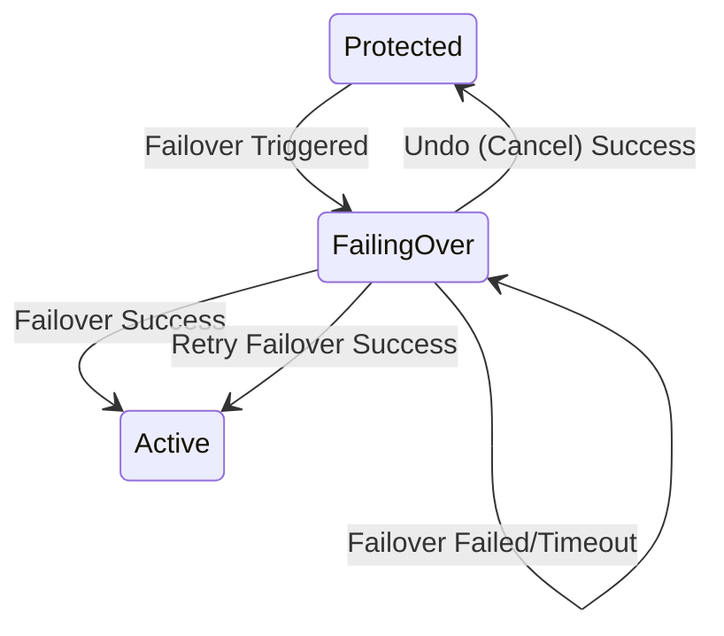

# Improve Failover State Handling & Recovery

## Summary
当前 Failover 过程中 Instance 状态保持 `Protected`，导致无法准确反映系统处于“中间状态”（源已缩容、同步已暂停）。
此外，当 Failover 超时或失败时，缺乏明确的机制来执行 Undo (取消/回滚) 或 Retry (重试)。
本提案旨在引入 `FailingOver` 中间状态，并放宽 Operation 的状态检查，以支持失败场景下的恢复操作。

## Motivation
1.  **可见性**: 用户需要知道 Instance 正在进行切换。
2.  **恢复能力**: 当切换失败（如超时、资源不足）时，用户必须能够选择：
    *   **Undo**: 放弃切换，恢复源端服务。
    *   **Retry**: 重新尝试切换到目标端（解决问题后）。

## Goals
*   在 Failover 开始时将 Instance 状态更新为 `FailingOver`。
*   允许在 `FailingOver` 状态下执行 `Undo` 操作。
*   允许在 `FailingOver` 状态下（当上一操作失败时）重新提交 `Failover` 操作以进行重试。

## Proposal

### 1. State Machine Updates

引入 `FailingOver` 状态作为中间态。

### 2. Operation Logic Changes

#### Failover Operation
*   **On Start**: 更新 Instance `FsmState` 为 `FailingOver`。
*   **On Failure**: Instance `FsmState` 保持 `FailingOver`。Operation Status 标记为 `Failed`。
*   **Validation**: 允许在 `FailingOver` 状态下创建新的 Failover Operation，**前提是**前一个 Operation 已经处于 `Failed` 或 `Completed` 状态（防止并发 Running）。

#### Undo Operation
*   **Constraint Update**: 修改 `handleUndo` 的前置检查。
    *   旧: `Status.FsmState == Active`
    *   新: `Status.FsmState == Active` OR `Status.FsmState == FailingOver`
*   **Step Logic**: Undo 逻辑本身（Scale Down Target -> Scale Up Source -> Resume）对于 `FailingOver` 状态通常也是适用的（因为 Target 可能还没完全 Scale Up，或者 Source 已经 Scale Down）。需要确保步骤幂等性。

### 3. API & CLI Impact
*   用户查询 Instance 时将看到 `FailingOver` 状态。
*   用户针对 `FailingOver` 的 Instance 可以调用 `Undo` 或再次 `Failover`。
